# k8s-security-elasticsearch

This project was created to allow hands on lab work to stand up a secure Elasticsearch and Kibana on a Kubernetes cluster.  It is designed to provide a working example of Elasticsearch security best practices when deploying to K8S.  Check out our blog post [here](https://www.c2labs.com/post/top-6-best-practices-for-securing-elasticsearch-in-kubernetes-hands-on-lab) on why this matters!

## Table of Contents

[What You Will Learn](#overview)<br>
[Prerequisites](#prereqs)<br>
[Deploy Cert-Manager and Generate Self-Signed SSL Certificates](#cert-manager)<br>
[Deploy Elasticsearch](#deploy-es)<br>
[Deploy Kibana](#deploy-kibana)<br>
[Closing Remarks](#closing-remarks)<br>

<a name="overview"/>

## What You Will Learn
- Deploy Cert-Manager and use it to generate self-signed SSL certificates
- Deploy Elasticsearch Master, Data, and Client components with xpack security enabled
- Auto generate Elasticsearch passwords and generate secrets for those passwords
- Enable SSL on Elasticsearch Client
- Deploy Kibana with SSL

<a name="prereqs"/>

## Prerequisites
- Kubernetes local cluster on docker-desktop or minikube running version 1.15 or greater
- Knowledge of Kubernetes and its object types like StatefulSets, DaemonSet, PersistentVolumes & init container
- Basic knowledge of Elasticsearch and Kibana
- Basic knowledge of Elasticsearch Node types and their roles (Master, Data & client nodes)
- The manifests in this repository
- It is recommended that you review and understand each manifest before deploying. Focus particularly on how the certs are mounted in a volume from the secrets.   

<a name="cert-manager"/>

## Deploy Cert-Manager and Generate Self-Signed SSL Certificates
We recommend using [Cert-Manager](https://cert-manager.io/docs/) to generate certificates on Kubernetes and in this example, we will be using self-signed certificates. Depending on your production senario, you would want use CA verifiable certificates to any externally exposed services 

**1. Install Cert-Manager**<br>
There are a few options to install Cert-Manager. We prefer using the raw K8S manifest directly from their repository. 

```
kubectl apply --validate=false -f https://github.com/jetstack/cert-manager/releases/download/v0.14.1/cert-manager.yaml
```

**2. Verify to make sure all the Cert-Manager pods and services are running**

```
kubectl get all -n cert-manager
```

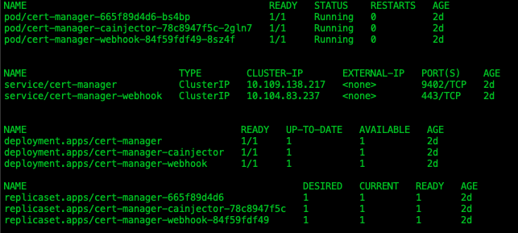

**3. Create the `es` Namespace**<br>
This namespace will be used for all the rest of the k8s objects in this example

```
kubectl apply -f namespace.yaml
```

**4. Deploy the Certificate Issuer**

```
kubectl apply -f cert-issuer.yaml
```

**5. Generate the certificates**<br>
This will generate SSL certificates and tls secrets using Cert-Manager for the Elasticsearch client node and Kibana

```
kubectl apply -f certs.yaml
```


**6. Verify that both the certficates and tls secrets have been generated**

```
kubectl get certificates -n es
```

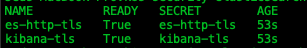

```
kubectl get secrets -n es
```

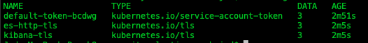

<a name="deploy-es"/>

## Deploy Elasticsearch

**1. Deploy the Master Node ConfigMap, Deployment, and Service**<br>
The `es-master.yaml` manifest will deploy a ConfigMap with that contains the settings for the master node with xpack.security enabled, the es-master node deployment, and the es-master service.

```
kubectl apply -f es-master.yaml
```

**2. Verify that the Master node pod and service is running**

```
kubectl get all -n es
```

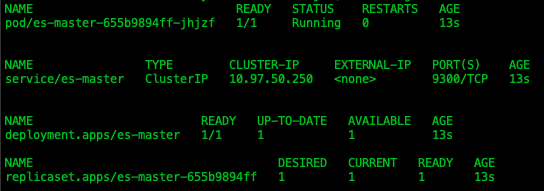

**3. Deploy the Data Node ConfigMap, Deployment, and Service**<br>
The `es-data.yaml` manifest will deploy a ConfigMap with that contains the settings for the data node with xpack.security enabled, the es-data node deployment, and the es-data service. 

```
kubectl apply -f es-data.yaml
```

**4. Verify that the Data node pod and service is running**<br>

```
kubectl get all -n es
```

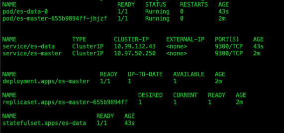

**5. Deploy the Client Node ConfigMap**<br>
The `es-client-configmap.yaml` contains the setting to for the client node with xpack.security enabled.  Note that we will be enabling SSL in a later step. 

```
kubectl apply -f es-client-configmap.yaml
```

**6. Deploy the Client Node StatefulSet and Service**<br>
 
```
kubectl apply -f es-client.yaml
```

**7. Verify that everything is up and running**

```
kubectl get all -n es
```

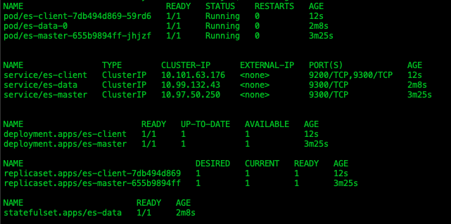

**8. Verify the Health of Elasticsearch**<br>
After a few minutes, the nodes should reconcile and the master node log file will contain the following: `"Cluster health status changed from [YELLOW] to [GREEN]"`

```
kubectl logs -f -n es $(kubectl get pods -n es | grep es-master | sed -n 1p | awk '{print $1}') | grep "Cluster health status changed from \[YELLOW\] to \[GREEN\]"
```

**9. Auto generate the Elasticsearch Passwords**<br>
With the xpack security module enabled, we can run a command on the `es-client` pod to generate the default users and passwords

```
kubectl exec -it $(kubectl get pods -n es | grep es-client | sed -n 1p | awk '{print $1}') -n es -- bin/elasticsearch-setup-passwords auto -b
```

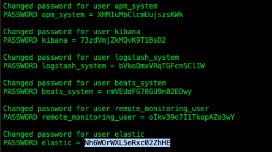

**10. Create the elastic user password secret**<br> 
Copy the `elastic` user password from step 9 and replace the password in the following command with the one that was generated.  You will want to save this password to log into Kibana for the first time. 

```
kubectl create secret generic es-pw-elastic -n es --from-literal password=sGhdgFLGKQeKszPPE24P
```

**11. Enable SSL on the Client node**<br>
We can now enable SSL on the Client node by updating the Client node ConfigMap and Restarting the pod

```
kubectl apply -f es-client-configmap-ssl.yaml
```

```
kubectl rollout restart deployment.app/es-client -n es
```

**12. Verify that everything is up and running**<br>

```
kubectl get all -n es
```

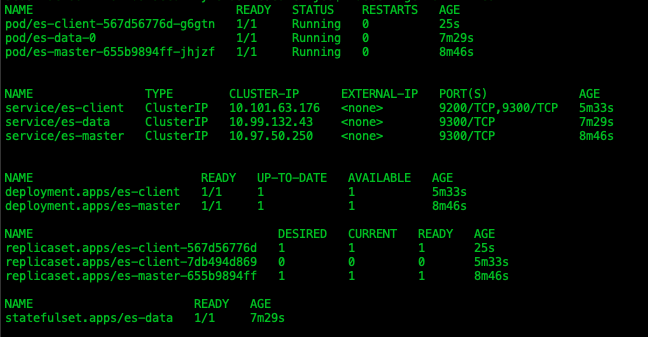

If all went well, you now have an Elasticsearch cluster running that is protected with the xpack security module and SSL enabled.

<a name="deploy-kibana"/>

## Deploy Kibana
This example uses the self-signed certificate that we created earlier.  If you deploy this in a production environment you will want to deploy with a vaild certificate issued by a CA authority.  Cert-Manager works great with [Let's Encrypt](https://letsencrypt.org/)!  

For this demonstration, we are using a NodePort to expose the Kibana service locally. Feel free to replace the service with a LoadBlancer or Ingress object as you see fit. 

**1. Deploy Kibana**

```
kubectl apply -f kibana.yaml
```

**2. Verify that the Kibana deployment and service are running**

```
kubectl get all -n es
```

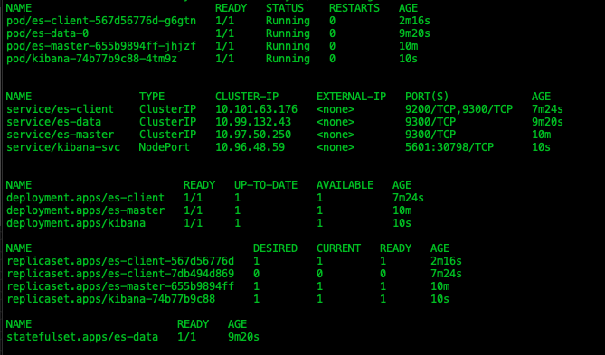

**3. Get the `kibana-svc` NodePort port**

```
kubectl get service kibana-svc -o wide -n es
```

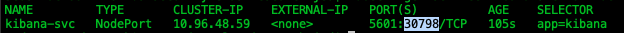

**4. Launch a web browser and go to `https://localhost:<KibanaNodePort>`**<br>
It takes a few minutes for Kibana to startup after the pod is running.  Because we used a self-signed cert you will need to acknowlegde that the cert cannot be verified and proceed to the site.  

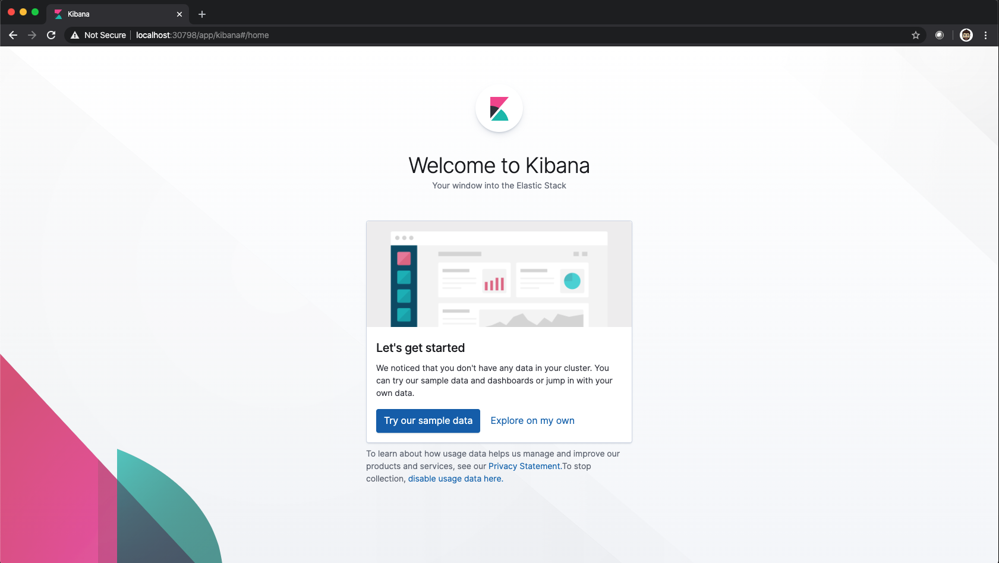

<a name="closing-remarks"/>

## Closing Remarks
- If all went well, you should have a secure Elasticstack with Kibana up and running locally and more importantly learned some fundamentals that you can use. 
- Take a look at the ConfigMap and Deployment in the `kibana.yaml` manifest.  You can use a similar configuration to run any of the Beats modules or Logstash securely. 
- Avoid exposing the Elasticsearch client to the internet.
- Your Elasticsearch cluster is only as secure as your k8s cluster, even with all of the above.
- [Enable Kibana RBAC](https://www.elastic.co/guide/en/kibana/current/development-security-rbac.html) and setup appropriate user permissions.
- Interested in containerizing and modernizing your applications?  [Contact us today for a free one hour consultation to find out how our C2 Labs DevOps engineers can accelerate your digital transformation.](https://www.c2labs.com/contact-us)


